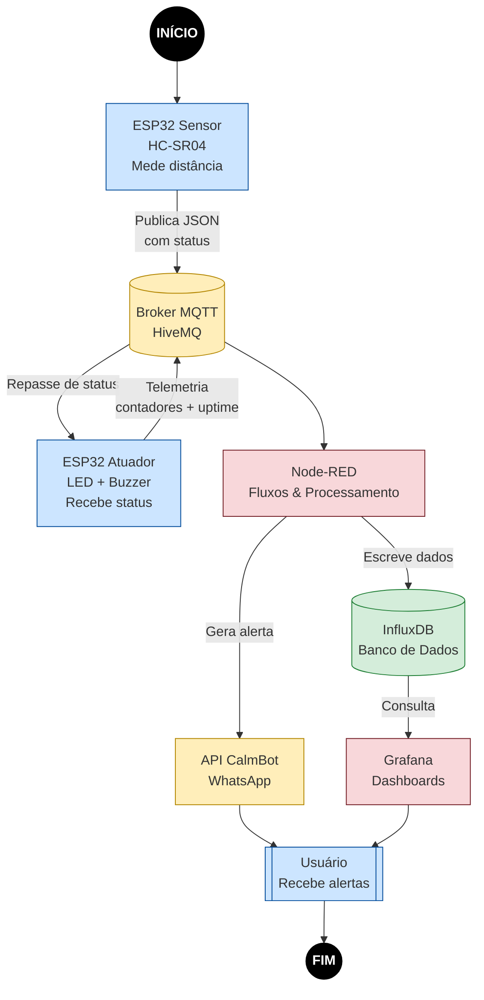

#  Sistema Inteligente de Monitoramento de Enchentes – IoT  
Universidade Presbiteriana Mackenzie  
**Data de criação:** Novembro de 2025  
**Integrantes:** 

Giulia barros Gondim - 10401908@mackenzista.com.br

Gabriel Bello - 10416808@mackenzista.com.br

---

##  Descrição Geral do Projeto

Este projeto implementa um sistema IoT completo para monitoramento de enchentes usando:

- ESP32 (com simulação via Wokwi)
- Sensor ultrassônico HC-SR04
- Node-RED (nuvem)
- MQTT (broker público)
- API CallMeBot → envio de alertas via WhatsApp
- InfluxDB (para armazenamento de séries temporais)
- Grafana (para dashboards e visualização)

O sistema identifica níveis de risco e envia alertas automaticamente, além de armazenar todos os dados no banco para análise.

---

##  Arquitetura Geral do Sistema

1. **ESP32 – Sensor Ultrassônico**
   - Mede distância da água em cm
   - Determina status: **SEGURO**, **ATENÇÃO**, **ENCHENTE**
   - Aciona LED e buzzer
   - Envia dados via MQTT

2. **ESP32 – Estação Ambiental**
   - ESP32 atuador assina tópico de status
   - LED e buzzer para alertas locais
   - Publica telemetria, eventos e estado
   - Envia contadores e tempos por tópico MQTT

3. **Node-RED**
   - Recebe dados do MQTT
   - Formata e envia alerta ao WhatsApp
   - Armazena tudo no InfluxDB

4. **InfluxDB**
   - Banco de dados time-series com registro completo dos eventos

5. **Grafana**
   - Dashboards em tempo real com:
     - Distância da água
     - Status da enchente
     - Distribuição dos eventos

---

## Funcionamento dos Sensores

### **Sensor Ultrassônico (HC-SR04)**
- Emite um pulso sonoro e calcula o tempo de retorno
- Converte para distância
- Regras:
  - > 20 cm → SEGURO  
  - 10–20 cm → ATENÇÃO  
  - < 10 cm → ENCHENTE  

### **Sensor Ambiental (DHT22 simulado)**
- Mede temperatura e umidade
- Dados servem para enriquecer o dashboard e análises climáticas

---

##  Funcionamento dos Atuadores

### **LED Vermelho**
- Acende somente em **ENCHENTE**

### **Buzzer**
- Ativado apenas em **ENCHENTE**

---

## Integração com APIs

### **API CallMeBot – WhatsApp**
Utilizada para envio automático de:

- Alertas de enchente
- Status atual
- Distância detectada

Node-RED monta e envia a mensagem formatada em texto.

   
